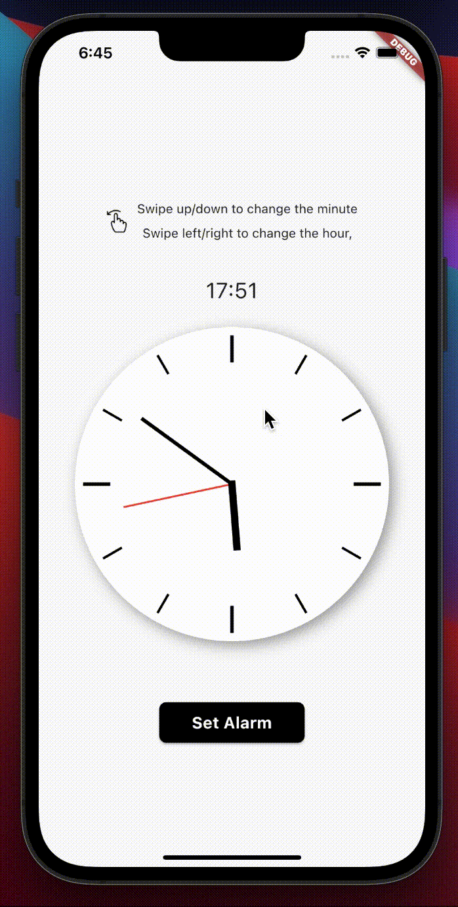

# Flutter Analog Clock
An Analog Clock View with swipe gesture detector to adjust the hour hand and minute hand of the clock using GetX as the State Management

# Demo
Here is the preview to adjust the clock's hand



# How to run
After you clone the project, do ```flutter pub get``` and simply ```flutter run``` on your emulator/simulator on the root project
